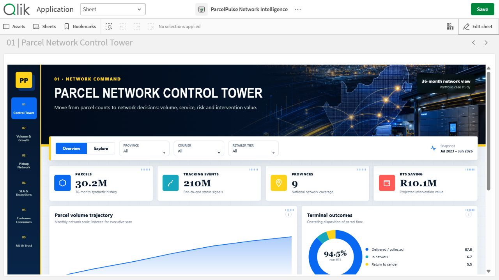

# ParcelPulse Network Intelligence

An employer-facing Qlik Sense Desktop portfolio app with six complete decision pages, a custom responsive extension and original project-specific artwork.

## Six pages

1. Parcel Network Control Tower
2. Parcel Volume & Growth
3. Pickup Point Network
4. Delivery SLA & Exception Intelligence
5. Customer & Route Economics
6. ML Control Tower & Trust

## Open locally

1. Copy `ParcelPulse Network Intelligence.qvf` to `Documents/Qlik/Sense/Apps`.
2. Copy `extension/parcelpulse-network-intelligence` to `Documents/Qlik/Sense/Extensions/parcelpulse-network-intelligence`.
3. Launch Qlik Sense Desktop and open the app.

The extension is bundled because the report uses a custom full-screen visual system. Data and model caveats are kept visible inside the app.
